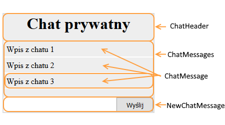

# Kompozycja &ndash; zadania

### Przygotowanie

> Stwórz w pełni działające środowiko, które pozwoli Ci pisać pliki JSX, skompilować je do plików JS i uruchomić działającą aplikację React.
> 
> Pamiętaj o:
> - ```npm init```
> - Zainstalowaniu odpowiednich modułów
> - Ustawieniu Webpacka, plikiem wejściowym ma być `js/app.jsx`, wyjściowym `js/out.js`

## Zadanie rozwiązywane z wykładowcą

### Dzielenie na komponenty (~ 10min - 15min)

Stwórz komponent `ShopItem` z odpowiednimi `props`, które wynikają z dalszej części zadania. Ma mieć on następującą strukturę:
```HTML
<div>
    <div>
        <h1>{title z props}</h1>
        
    </div>
    <article>
        <p>{description z props}</p>
    </article>
    <div>
        Cena: {price z props}
        <button>Kup!</button>
    </div>
</div>
```

Następnie podziel go na 4 komponenty:
- `ShopItemHeader`
- `ShopItemDescription`
- `ShopItemPricing`
- `ShopItem`, który ma dalej podstawową strukturę i korzysta z powyższych.

Wyrenderuj na stronie komponent `ShopItem` podając w atrybutach do props przykładowe dane.

**Pamiętaj, aby zbudować jeszcze główny komponent `App`, a w nim wykorzystywać komponenty budowane w ćwiczeniach. Renderuj na stronie główny komponent `App`.**

**Zadanie wykonaj tylko komponentami w wersji zbudowanej z klas ES6**

## Zadania do samodzielnego wykonania

### Zadanie 1 (~ 15min)

Wykorzystaj zadanie zrobione z wykładowcą.

Stwórz komponent o nazwie `ShopList`. Niech przyjmuje on w `props` tablicę obiektów z elementami koszyka.
                                      
Obiekty mają być w takiej formie:

```JavaScript
{
    title   :   'nazwa przedmiotu',
    image   :   'url_do_obrazu_przedmiotu'
}
```

Powinien on wyświetlać w divie o klasie CSS `shopitems` same komponenty `ShopItemHeader` z odpowiednimi danymi. Wykorzystaj `array.map()`.

Wyrenderuj go na stronie podając w atrybucie do props następujący atrybut `menu`:
```JavaScript
[
    {
        title   :   'Mysz komputerowa',
        image   :   'https://upload.wikimedia.org/wikipedia/commons/a/aa/3-Tastenmaus_Microsoft.jpg'
    },
    {
        title   :   'Klawiatura',
        image   :   'https://upload.wikimedia.org/wikipedia/commons/thumb/6/66/Computer_keyboard_Danish_layout.svg/1000px-Computer_keyboard_Danish_layout.svg.png'
    },
    {
        title   :   'Laptopr programisty',
        image   :   'https://upload.wikimedia.org/wikipedia/commons/thumb/b/b9/Typing_computer_screen_reflection.jpg/640px-Typing_computer_screen_reflection.jpg'
    }
]
```
**Pamiętaj, aby zbudować jeszcze główny komponent `App`, a w nim wykorzystywać komponenty budowane w ćwiczeniach. Renderuj na stronie główny komponent `App`.**

**Zadanie wykonaj tylko komponentami w wersji zbudowanej z klas ES6**

### Zadanie 2 (~ 10min - 15min)

> Aby wykonać to zadanie, zmień ustawienie w webpack.config.js dla ```entry```, aby wyglądało w ten sposób:
> ```JavaScript
> entry: "./js/zadanie02.jsx",
> ```
> **Odpowiedzi do tego zadania wpisuj do pliku ```js/zadanie02.jsx```.**

W pliku `js/zadanie02.jsx` jest stworzony komponent Chat. Podziel go według tego schematu:

 

**Zadanie wykonaj w dwóch wersjach:**
- **Najpierw komponentem w wersji funkcyjnej**
- **Oraz tym samym komponentem w wersji zbudowanej z klasy ES6**